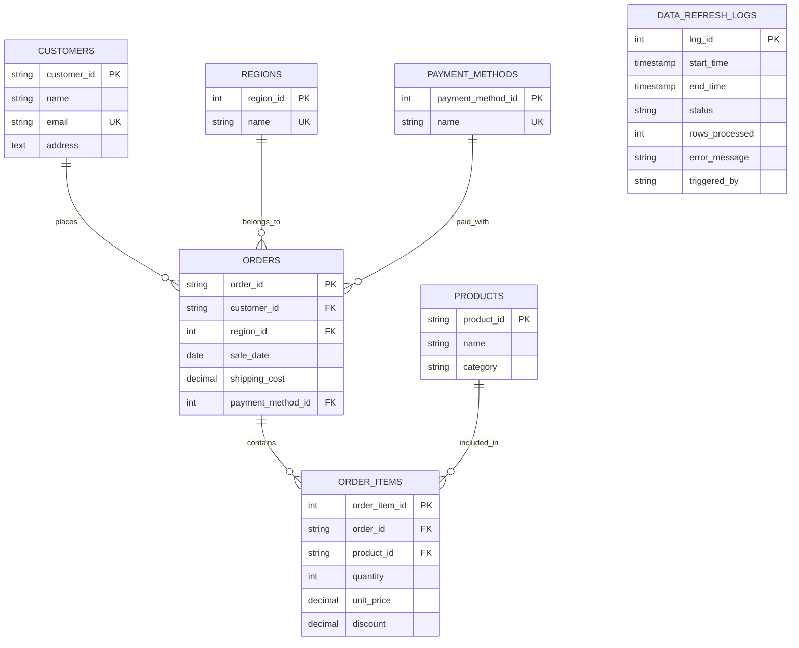

# Backend Assessment

Loads Data from CSV into a PostgreSQL database, and also provides a REST API for querying the data with analytics.

## How to run the project

1. **Configure Environment Variables**:
   - Copy the `.env.example` file to `.env` and adjust values as needed
   - Required variables: `DB_HOST`, `DB_PORT`, `DB_USER`, `DB_PASSWORD`, `DB_NAME`, `SERVER_PORT`

2. **Setup Database**:
   ```sh
   # Install and run PostgreSQL
   # Then run migrations:
   go run github.com/golang-migrate/migrate/v4/cmd/migrate \
     -database "postgres://$DB_USER:$DB_PASSWORD@$DB_HOST:$DB_PORT/$DB_NAME?sslmode=disable" \
     -path migrations up
   ```

3. **Run the Application**:
   ```sh
   go run ./cmd/api
   ```

## API Routes

| Endpoint | Method | Description |
|----------|--------|-------------|
| `/api/revenue/total` | GET | Get total revenue across all sales |
| `/api/revenue/by-product` | GET | Get revenue breakdown by product |
| `/api/revenue/by-category` | GET | Get revenue breakdown by product category |
| `/api/revenue/by-region` | GET | Get revenue breakdown by geographical region |
| `/api/revenue/over-time` | GET | Get revenue trends over time (daily/monthly/yearly) |
| `/api/data/refresh` | POST | Trigger a manual refresh of the sales data from CSV |

## Database Schema



## Design Decisions

### API Design

1. Organized endpoints around resource, and have structured them in routes.go
2. Allowed filtering analytics by date ranges and other parameters
3. have given a manual endpoint to trigger data updates via API for operational flexibility

### Database Design

1. Normalized with separate tables for customers, products, regions, etc.
2. Indexed on frequently queried fields (order_id, customer_id, sale_date) considering performance
3. Used foreign keys to maintain referential integrity across tables
4. Added data_refresh_logs to track ETL operations with detailed status information
5. Schema designed to efficiently support various analytical queries

The Project follows a clean architecture based on go standards:
- `cmd/api`: Application entry points
- `internal`: Core business logic and implementation details
- `config`: Configuration management
- `migrations`: Database schema versioning

## Performance Considerations

1. Batch Processing
2. Indexing on frequently queried fields
3. Have added fliexbility to set open connections, idle connections to the database, which can be set according to the needs of the system.